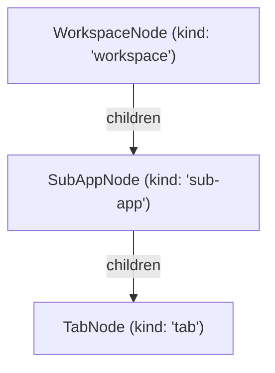

# Sub-app architecture

This page explains the three-level sidebar tree (workspace → sub-app → tab), the four sub-apps that exist today, how per-workspace storage works, and the minimal steps required to add a new sub-app.

## Contents

- [The sidebar tree](#the-sidebar-tree)
- [Sub-apps](#sub-apps)
- [Per-workspace storage](#per-workspace-storage)
- [Home workspace aggregation](#home-workspace-aggregation)
- [How to add a new sub-app](#how-to-add-a-new-sub-app)
- [See also](#see-also)

---

## The sidebar tree

The `WorkspaceSidebar` renders a three-level tree. The structure is encoded in `WorkspaceTreeNode` (`packages/shared/src/workspace.ts`), a discriminated union on the `kind` field:



Each node type carries the fields needed to render it and nothing more:

| Node kind    | Key fields                                                   |
| ------------ | ------------------------------------------------------------ |
| `workspace`  | `workspaceId`, `expanded`                                    |
| `sub-app`    | `workspaceId`, `subAppId`, `expanded`, `children: TabNode[]` |
| `tab` (leaf) | `workspaceId`, `subAppId`, `sessionId`, `active`, `status`   |

`TabNode` carries no `children` field — it is always a leaf.

---

## Sub-apps

`SubAppId` (`packages/shared/src/sub-app.ts`) is a Zod enum that is the exhaustive list of available sub-apps:

```ts
export const SubAppId = z.enum(['supatty', 'notes', 'dashboard', 'explorer'])
```

| `SubAppId`  | What it is                                                                       |
| ----------- | -------------------------------------------------------------------------------- |
| `supatty`   | Terminal pane — one or more PTY sessions displayed in xterm.js                   |
| `notes`     | Plain-text notes tied to the workspace (persisted via `notes:get` / `notes:set`) |
| `dashboard` | Workspace overview pane                                                          |
| `explorer`  | Finder-style Miller-column file browser                                          |

Each sub-app entry in `SubAppId` maps 1:1 to a `SubAppStore` subclass on the main side and a `<SubAppId>.json` file under Electron's `userData` directory.

---

## Per-workspace storage

Every sub-app that needs to persist data uses the `SubAppEnvelope` shape (`packages/shared/src/sub-app.ts`):

```ts
export const SubAppEnvelope = <T extends z.ZodTypeAny>(dataSchema: T) =>
  z.object({
    byWorkspace: z.record(z.string().uuid(), dataSchema),
  })
```

The outer file (`<subAppId>.json`) holds one key per workspace UUID. Each workspace therefore has an isolated payload for that sub-app. An unknown workspace id returns the sub-app's default value — it is never persisted as `null` and never throws.

---

## How to add a new sub-app

1. **Shared types** — Add the new id to `SubAppId` in `packages/shared/src/sub-app.ts`.
2. **Domain types** — Add any `Task`-like types + a Zod schema in a new file under `packages/shared/src/`.
3. **IPC channels** — Add request/response schemas to `packages/shared/src/ipc.ts` and register the channel names in `IpcChannel`.
4. **Main store** — Create a `SubAppStore` subclass that wraps `SubAppEnvelope(YourSchema)` and wire it into `apps/main/src/index.ts`.
5. **IPC handler** — Add a handler file under `apps/main/src/ipc/` (call `Schema.parse(raw)` as the first line — see `docs/architecture/ipc.md`).
6. **Preload bridge** — Expose the new calls on `window.ws` in `apps/preload/src/index.ts`.
7. **Renderer component** — Create a folder under `apps/renderer/src/sub-apps/<name>/` with an `index.tsx` entry point.
8. **Register in sidebar** — Add the sub-app slot to the sidebar tree builder so the `WorkspaceSidebar` renders it.

A sub-app does **not** need its own scrollbar style — apply `.supa-scroll` to the scroll root of its container (see `CLAUDE.md` > Architecture > Conventions).

---

## See also

- `packages/shared/src/sub-app.ts` — `SubAppId`, `SubAppEnvelope`.
- `packages/shared/src/workspace.ts` — `WorkspaceTreeNode` (sidebar tree schema).
- `apps/renderer/src/sub-apps/` — renderer entry points per sub-app.
- [workspace-scope.md](./workspace-scope.md) — workspace kinds and scope enforcement.
